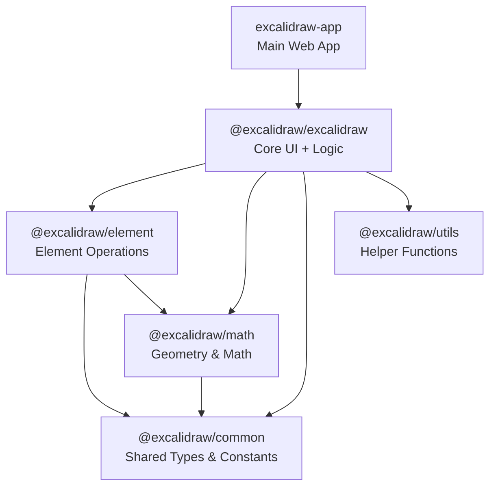
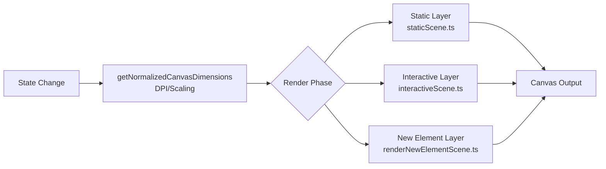
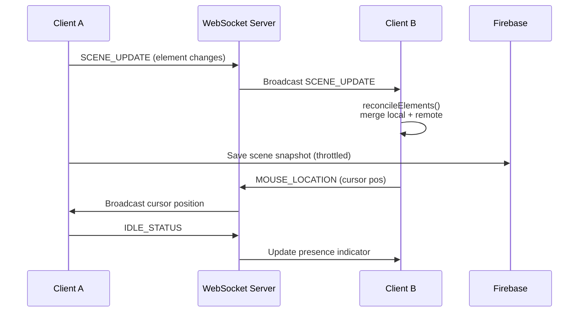
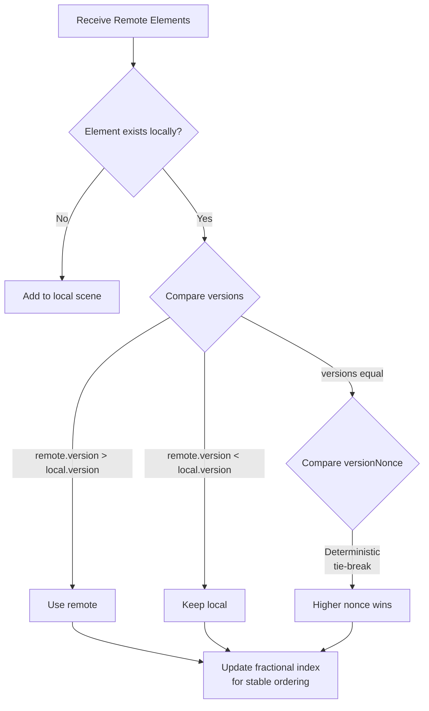
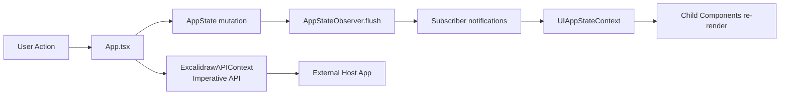

# System Patterns

## Architecture Overview
Excalidraw is a monorepo with Yarn workspaces. The main web app (`excalidraw-app/`) consumes shared packages (`packages/*`). The core library is published as `@excalidraw/excalidraw` for third-party use.



## State Management

### Jotai (Primary)
- Atomic state model — one atom per piece of state
- Isolated per editor instance via `jotai-scope` (`createIsolation()`)
- Centralized in `packages/excalidraw/editor-jotai.ts`
- Exports wrapped hooks: `useAtom`, `useSetAtom`, `useAtomValue`, `useStore`

### AppState (Imperative)
- Traditional state object (`AppState` type) managed by `AppStateObserver`
- Subscription-based with flexible selectors (single key, arrays, custom functions)
- Supports one-time subscriptions and Promise-based waiting
- Batched updates via React's `unstable_batchedUpdates`

### Context Patterns
- **TunnelsContext** (via `tunnel-rat`): Portal-based component composition for UI extension points (MainMenuTunnel, WelcomeScreenTunnel, FooterCenterTunnel, etc.)
- **UIAppStateContext**: Simple context for UI-related state
- **ExcalidrawAPIContext**: Imperative API access across component tree

## Rendering Pipeline

### Multi-Layer Canvas
- **Static layer** (`staticScene.ts`): Background rendering of elements
- **Interactive layer** (`interactiveScene.ts`, ~57KB): Selection handles, transform controls, snapping guides
- **SVG layer** (`staticSvgScene.ts`): Export rendering
- **New element layer** (`renderNewElementScene.ts`): Elements being created

### Rendering Flow



- Canvas-based (not DOM) for performance
- Separate chunks for different render phases (optimization)

## Collaboration Architecture

### Real-time Sync
- `Collab.tsx` (PureComponent) — main collaboration manager
- **Portal**: WebSocket abstraction via socket.io-client
- **FileManager**: Asset upload/download synchronization
- Throttled sync: `SYNC_FULL_SCENE_INTERVAL_MS`

### WebSocket Events
- `SERVER_VOLATILE`, `SERVER` — server messages
- `USER_FOLLOW`, `USER_FOLLOW_ROOM_CHANGE` — user following
- Subtypes: `SCENE_INIT`, `SCENE_UPDATE`, `MOUSE_LOCATION`, `IDLE_STATUS`, `USER_VISIBLE_SCENE_BOUNDS`

### Collaboration Flow



### Conflict Resolution (`reconcileElements()`)



- Preserves local edits if element is actively being edited
- Fractional indices (`fractional-indexing`) for stable element ordering

### Presence
- Cursor positions tracked per collaborator
- Idle state management: `IDLE_THRESHOLD`, `ACTIVE_THRESHOLD`
- Laser pointer mode support

## Component Patterns

### Structure
- Flat, single-file per component (e.g., `Button.tsx`, `Dialog.tsx`)
- PascalCase naming with colocated `.scss` files
- 156+ components in `packages/excalidraw/components/`
- Complex components get subdirectories (ColorPicker, CommandPalette)

### Props Pattern
```tsx
interface ButtonProps extends React.DetailedHTMLProps<...> {
  type?: "button" | "submit" | "reset";
  onSelect: () => any;
  selected?: boolean;
  children: React.ReactNode;
}
```

## Action Pattern

### Action System (`packages/excalidraw/actions/`)

The action system is the primary way user interactions are handled. Each action is a self-contained unit with:

- **`name`**: Unique `ActionName` identifier (100+ actions: copy, paste, undo, selectAll, export, etc.)
- **`perform()`**: Function that receives current state and returns `ActionResult` (partial updates to elements/appState/files)
- **`label`** / **`icon`**: UI representation for toolbars and menus
- **`keyTest()`**: Optional keyboard shortcut matcher
- **`predicate()`**: Optional condition for when the action is available

### Action Sources

Actions can be triggered from multiple sources (`ActionSource`):

| Source | Example |
|--------|---------|
| `"ui"` | Clicking a toolbar button |
| `"keyboard"` | Pressing Ctrl+Z |
| `"contextMenu"` | Right-click menu |
| `"api"` | ExcalidrawImperativeAPI call |
| `"commandPalette"` | Fuzzy search selection |

### Registration & Execution

1. Actions are registered in `packages/excalidraw/actions/` (one file per action group)
2. `App.tsx` holds the action manager that dispatches actions
3. Each action's `perform()` returns an `ActionResult` which is merged into current state
4. UI components use action metadata (label, icon, keyTest) to render buttons and shortcuts

## Data Flow

### Unidirectional



### Persistence
- **LocalStorage**: `EditorLocalStorage.ts` + `idb-keyval` (IndexedDB)
- **Cloud**: Firebase Firestore + Storage
- **API**: JSON backend (`json.excalidraw.com/api/v2/`)
- **File**: PNG metadata embedding for scene data in exports

## Error Handling
Custom error hierarchy in `packages/excalidraw/errors.ts`:
- `CanvasError` — Canvas rendering failures
- `AbortError` — Request cancellation
- `ImageSceneDataError` — Scene encoding/decoding
- `WorkerUrlNotDefinedError` — Worker bundle issues
- `RequestError` — HTTP failures with status codes
- `ExcalidrawError` — Generic handled errors

Errors surface via error dialogs + Sentry tracking.

## File Naming Conventions
- **Components**: PascalCase (`Button.tsx`, `App.tsx`)
- **Utilities**: camelCase (`appState.ts`, `clipboard.ts`)
- **Styles**: Colocated `.scss` with matching name
- **Tests**: `*.test.ts` suffix, colocated with source
- **Imports**: Path aliases via tsconfig (`@excalidraw/*`)

## Related Docs
- [Architecture](../technical/architecture.md) — high-level system diagrams
- [Dev Setup](../technical/dev-setup.md) — onboarding and common commands
- [Tech Context](./techContext.md) — full dependency list
- [Decision Log](./decisionLog.md) — rationale for architectural choices
- [Domain Glossary](../product/domain-glossary.md) — terminology reference
