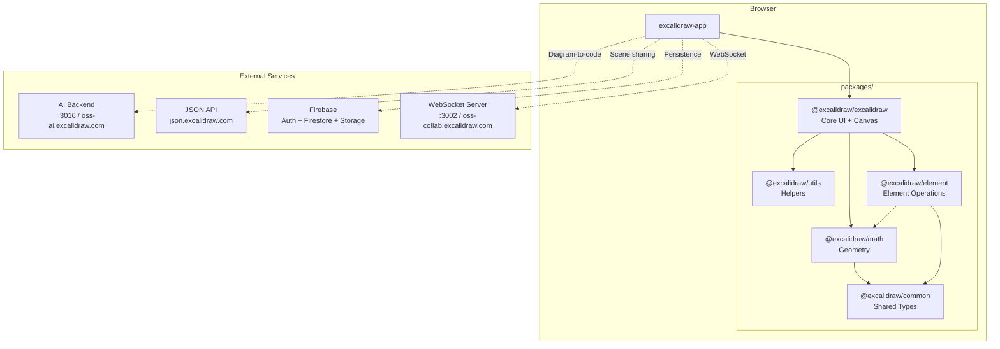
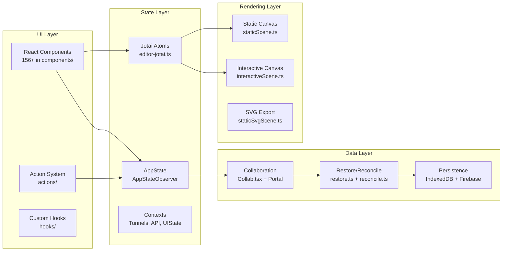
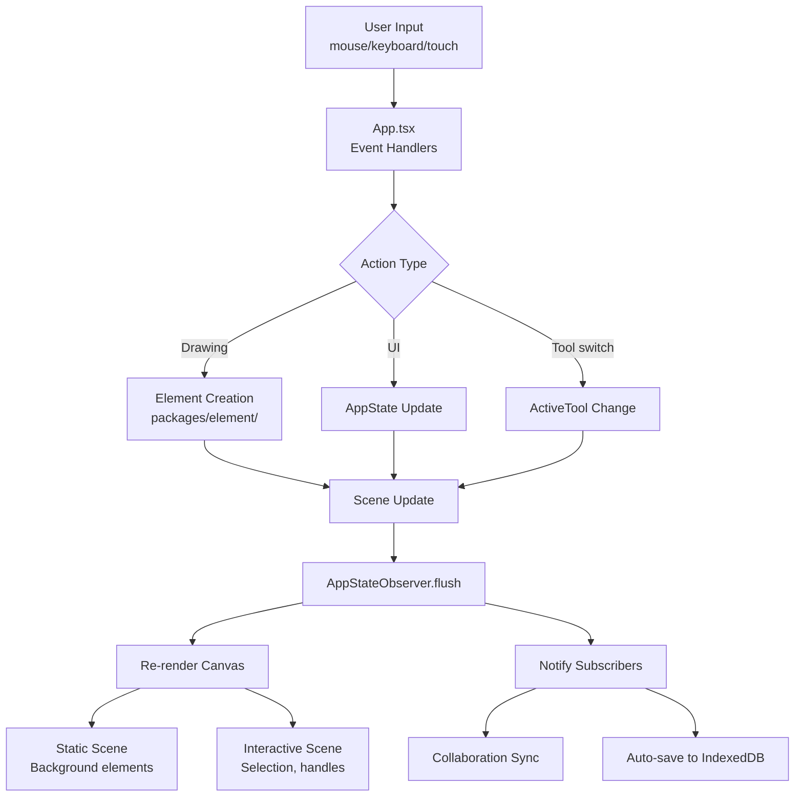
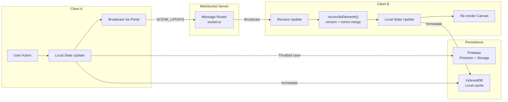
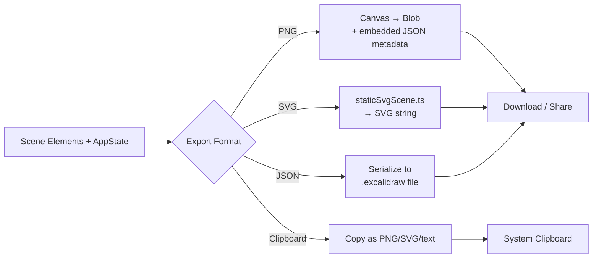
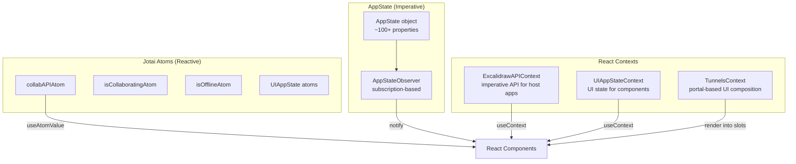
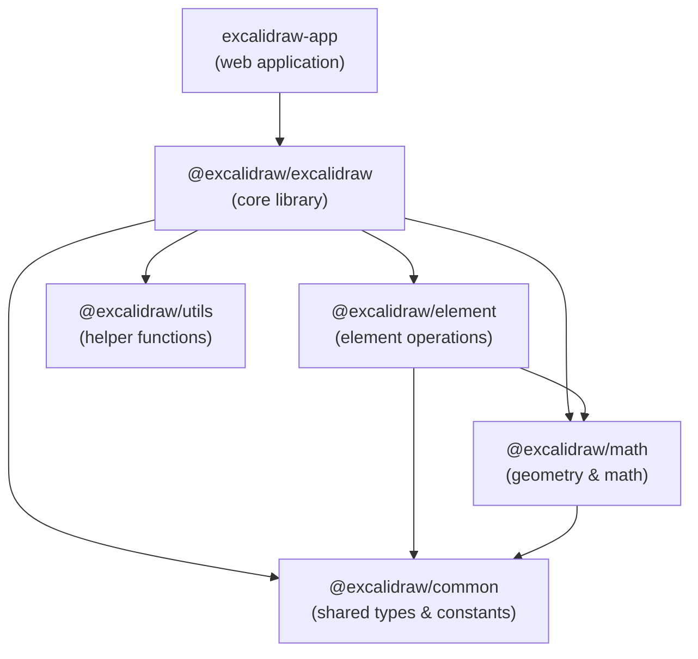
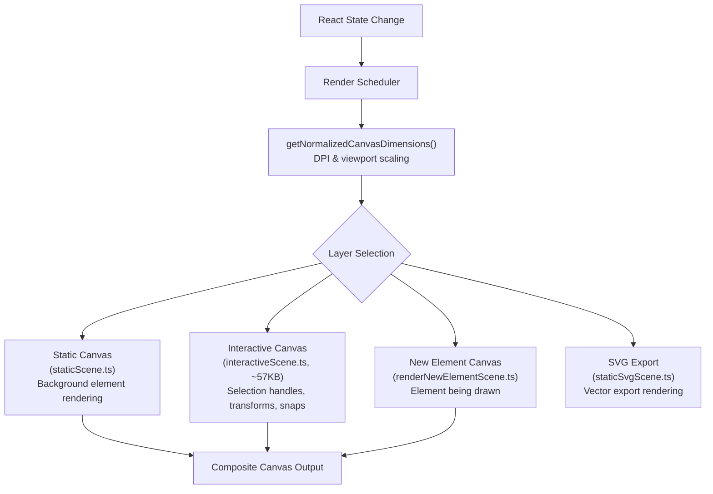

# Architecture

> High-level architecture of the Excalidraw codebase. For detailed patterns see [systemPatterns.md](../memory/systemPatterns.md).

## System Diagram



## Layer Architecture



## Data Flow

### User Interaction Flow



### Collaboration Data Flow



### Export Data Flow



### State Management Flow



## Package Dependencies

### Dependency Graph



### Package Details

| Package | Purpose | Key Exports | Build |
|---------|---------|-------------|-------|
| `@excalidraw/common` | Foundation layer | Constants (`FONT_FAMILY`, `TOOL_TYPE`, `EVENT`), shared types, utility functions | esbuild → ESM |
| `@excalidraw/math` | Geometry engine | Point/vector operations, curve math, polygon intersection, angle calculations | esbuild → ESM |
| `@excalidraw/element` | Element operations | Element types (`ExcalidrawElement` union), creation, mutation, binding, collision detection | esbuild → ESM |
| `@excalidraw/excalidraw` | Core UI library | React component, actions, renderer, state management, data layer | esbuild → ESM |
| `@excalidraw/utils` | Standalone helpers | Scene export utilities, element helpers (no React dependency) | esbuild → ESM |

### Build Order (Critical)

Packages must be built in dependency order:

```text
1. @excalidraw/common    (no internal deps)
2. @excalidraw/math      (depends on common)
3. @excalidraw/element   (depends on common, math)
4. @excalidraw/excalidraw (depends on all above)
5. @excalidraw/utils     (depends on common)
```

Command: `yarn build:packages` handles this automatically.

### External Dependency Map

| Category | Package | Used By | Purpose |
|----------|---------|---------|---------|
| **Rendering** | `roughjs` | excalidraw | Hand-drawn shape rendering |
| **Rendering** | `perfect-freehand` | excalidraw | Smooth freehand strokes |
| **State** | `jotai` + `jotai-scope` | excalidraw | Atomic state, per-instance isolation |
| **Collaboration** | `socket.io-client` | excalidraw-app | WebSocket real-time sync |
| **Persistence** | `firebase` | excalidraw-app | Auth, Firestore, Cloud Storage |
| **Persistence** | `idb-keyval` | excalidraw | IndexedDB wrapper for local save |
| **Data** | `pako` | excalidraw | Compression for scene data |
| **Data** | `nanoid` | excalidraw | Unique element ID generation |
| **Data** | `fractional-indexing` | excalidraw | Stable element ordering for multiplayer |
| **Data** | `png-chunk-text` | excalidraw | Embed scene JSON in PNG exports |
| **UI** | `clsx` | excalidraw | Conditional CSS class names |
| **UI** | `fuzzy` | excalidraw | Fuzzy search for command palette |
| **i18n** | `i18next` | excalidraw | 60+ language translations |
| **Code** | `@codemirror/*` | excalidraw | In-app code editing |
| **Monitoring** | `@sentry/browser` | excalidraw-app | Error tracking (production) |

## Rendering Pipeline

### Canvas Layers

Excalidraw uses a multi-layer canvas approach for performance. Each layer serves a distinct purpose:



### Render Cycle

1. **State mutation** triggers render via `AppStateObserver`
2. **DPI normalization** adapts to device pixel ratio
3. **Static layer** renders all committed elements (cached when possible)
4. **Interactive layer** renders selection UI, transform handles, snap guides
5. **New element layer** renders the element currently being drawn
6. **Composite** layers are stacked in the browser

### Key Optimizations

- Layers are rendered independently — only dirty layers re-render
- Static scene is cached and reused when only interactive state changes
- `requestAnimationFrame` throttling prevents excessive renders
- Chunk-based rendering splits work across frames for large scenes

## Key Design Principles

1. **Canvas-first**: All drawing happens on HTML Canvas (not DOM) for performance
2. **Atomic state**: Jotai atoms isolated per editor instance via `jotai-scope`
3. **Offline-first**: IndexedDB auto-save, PWA with service worker
4. **Embeddable**: Core is a publishable React component (`@excalidraw/excalidraw`)
5. **Collaboration-native**: WebSocket sync with conflict resolution built-in

## Directory Map

```text
excalidraw-app/              → Web application shell
├── collab/                  → Real-time collaboration (Collab.tsx, Portal)
├── components/              → App-specific UI
├── data/                    → Firebase config, file management
└── vite.config.mts          → Build configuration

packages/excalidraw/         → Core library (555+ TS/TSX files)
├── components/              → 156+ React components
│   └── App.tsx              → Monolithic core (~407KB)
├── renderer/                → Canvas rendering pipeline
├── actions/                 → Action system (tools, transforms, clipboard)
├── data/                    → Persistence, export, reconciliation
├── hooks/                   → Custom React hooks
├── context/                 → Tunnels, contexts
├── scene/                   → Scene management
├── editor-jotai.ts          → Jotai store configuration
├── errors.ts                → Custom error hierarchy
└── types.ts                 → Core type definitions

packages/element/            → Element operations
packages/math/               → Geometry & math utilities
packages/common/             → Shared constants & types
packages/utils/              → Helper functions
```

## Related Docs

- [Dev Setup](./dev-setup.md) — onboarding guide
- [System Patterns](../memory/systemPatterns.md) — state management, rendering pipeline, collaboration flow
- [Tech Context](../memory/techContext.md) — dependencies and versions
- [Decision Log](../memory/decisionLog.md) — architectural decisions with rationale
